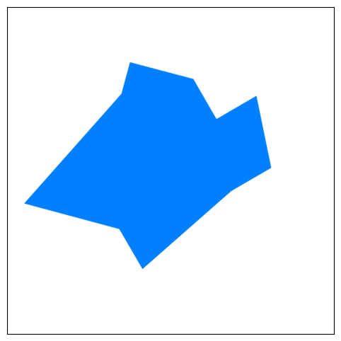

# Getting Started

## Installation

To start using Otary, simply install it via pip:

```bash
pip install otary
```

For more information on how to install Otary, please refer to the [Installation](installation.md) page.

## Usage

```python
import otary as ot

#instantiate an image
im = ot.Image.from_fillvalue(shape=(1000, 1000, 3))

# instantiate a polygon
polygon = ot.Polygon(points=[[1, 7], [3, 3], [3, 2], [5, 2], [6, 3], [7, 2], [8, 4], [7, 5], [5, 8], [4, 7]])

# scale the polygon
polygon *= 100

# rotate the polygon (pivot point is by default the centroid of the geometry entity)
polygon.rotate(angle=15, is_clockwise=True, is_degree=True)

# draw the polygon on the image
im.draw_polygons(polygons=[polygon], render=ot.PolygonsRender(thickness=2, is_filled=True, default_color=(255, 127, 0)))

im.show()
```


