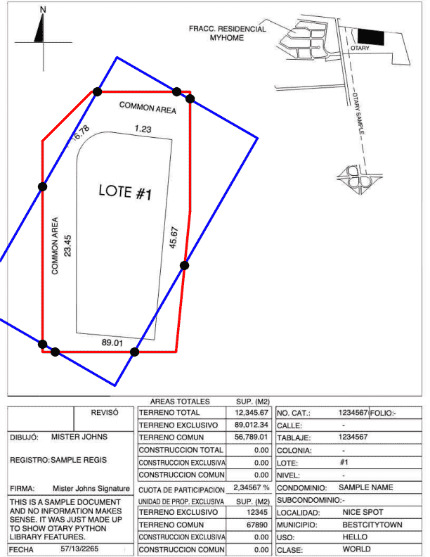

# Intersection of Geometric Objects

Otary is only based on [Shapely](https://shapely.readthedocs.io/en/stable/index.html)
so you can also process your geometric objects to extract, for example,
the intersection points.

``` py linenums="1" hl_lines="13"
import otary as ot

im = ot.Image.from_file("../tests/data/vision/example2/sample-otary-img1.pdf")

polygon_array = np.array(
    [[60, 200], [130, 130], [270, 130.1], [270, 300], [250, 500], [60, 500]],
    dtype=np.float32
)

polygon = ot.Polygon(polygon_array)
aabb = polygon.obb().expand(1.1).rotate(30, is_degree=True)

intersections_points = aabb.intersection(polygon)

im.copy().draw_polygons(
    polygons=[aabb, polygon],
    render=ot.PolygonsRender(colors=["blue", "red"], thickness=2),
).draw_points(
    points=intersections_points,
    render=ot.PointsRender(default_color="black", thickness=10),
).show()
```


