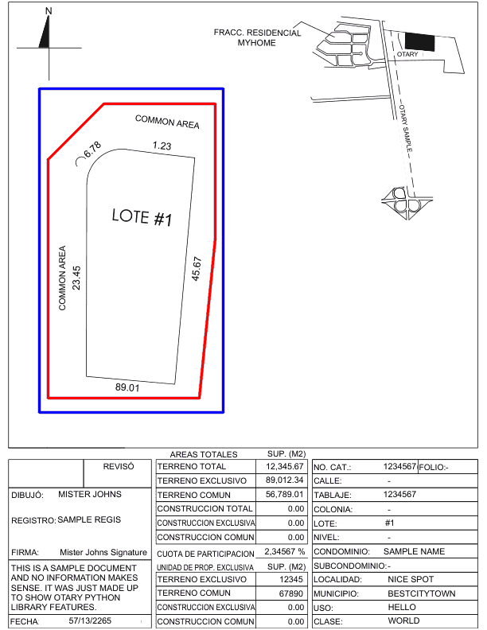
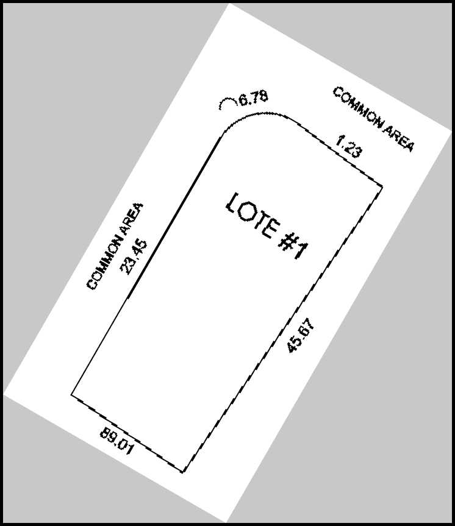

# General example

Otary unifies geometry and image processing in a single API.

You can construct geometric entities, render them onto an image, and apply image-processing transformations, all within the same workflow, without switching between libraries.

## Image and Geometry at once

Because visual output is the best way to verify a transformation, the example below walks through this end-to-end.

```python
im = ot.Image.from_file("../tests/data/vision/example2/sample-otary-img1.pdf")

polygon_array = np.array(
    [[60, 200], [130, 130], [270, 130], [270, 300], [250, 500], [60, 500]]
)

polygon = ot.Polygon(polygon_array)
aabb = polygon.aabb().expand(1.1) # Axis Aligned Bounding Box (AABB)

im.copy().draw_polygons(
    polygons=[polygon, aabb],
    render=ot.PolygonsRender(colors=["red", "blue"], thickness=2),
).show()
```



## Advanced Image Manipulation

Suppose you what to manipulate the image in a given part of it. Here is
an example of what you could do.

```python
im.crop_from_axis_aligned_bbox(aabb, copy=True) \
  .threshold_sauvola(k=0.1) \
  .resize(factor=2, copy=True) \
  .rotate(30, is_degree=True, is_clockwise=True, fill_value=200) \
  .add_border(5, fill_value=0)
```

The previous code does the following:

1. Crop the image from the AABB
2. Apply a threshold to binarize the image. It is now composed of only two values: 0 & 255
3. Resize the image by a factor of 2
4. Rotate the image by 30 degrees clockwise
5. Add a black border to the image

And here is the result:



Otary is designed to be interactive and user-friendly, ideal for [Jupyter notebooks](https://jupyter.org) and live exploration.

!!! tip "Enhanced Interactivity"

    In a Jupyter notebook, you can easily test and iterate on transformations by simply commenting part of the code as you need it and quickly see the result.

    ```python
    im.crop_from_axis_aligned_bbox(aabb, copy=True) \
    .threshold_sauvola(k=0.1) \
    # .resize(factor=2, copy=True) \
    # .rotate(30, is_degree=True, is_clockwise=True, fill_value=200) \
    .add_border(5, fill_value=0)
    ```
