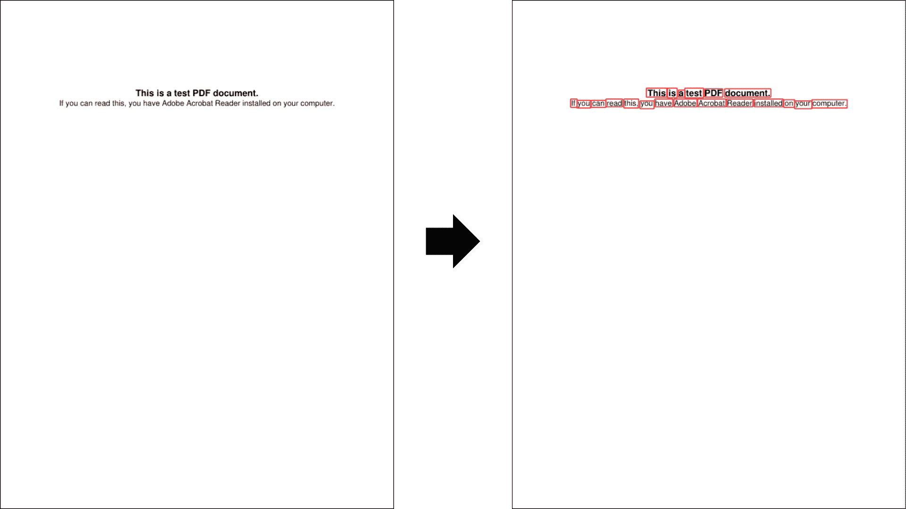
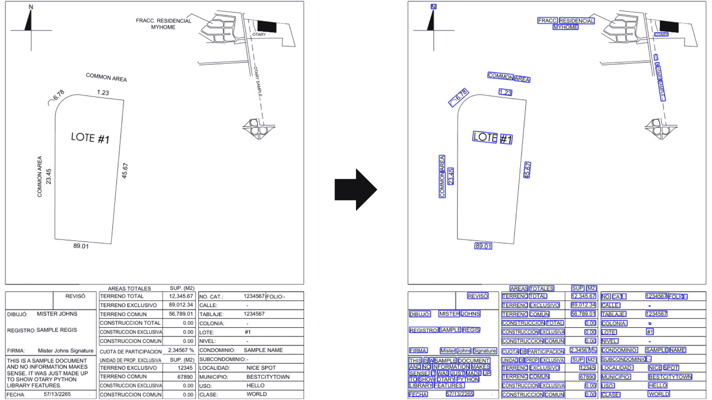
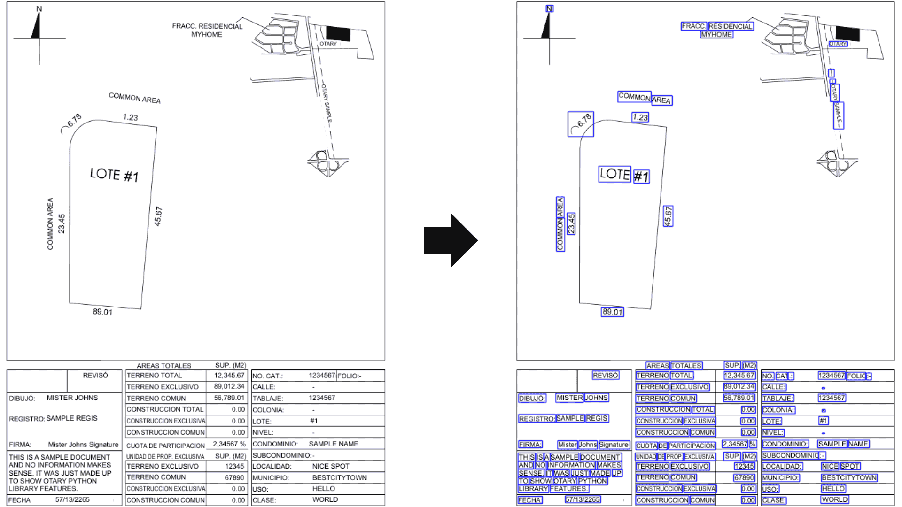
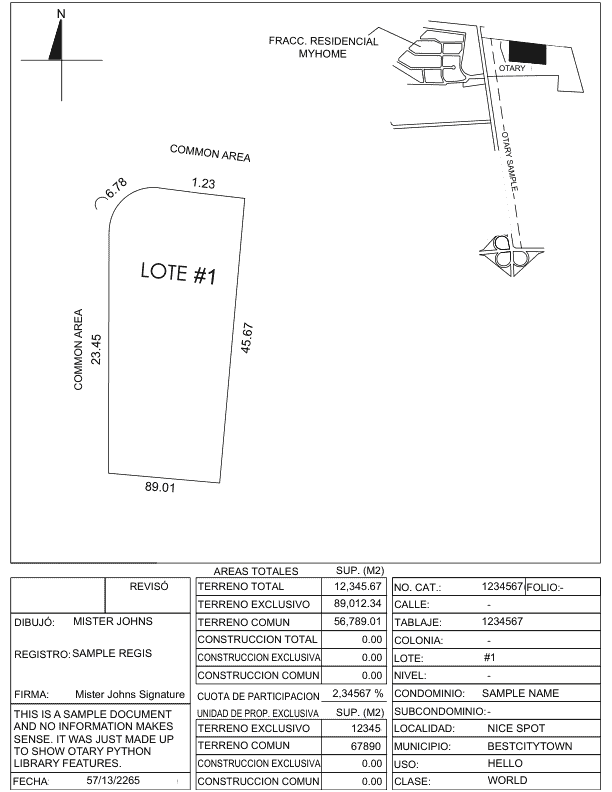
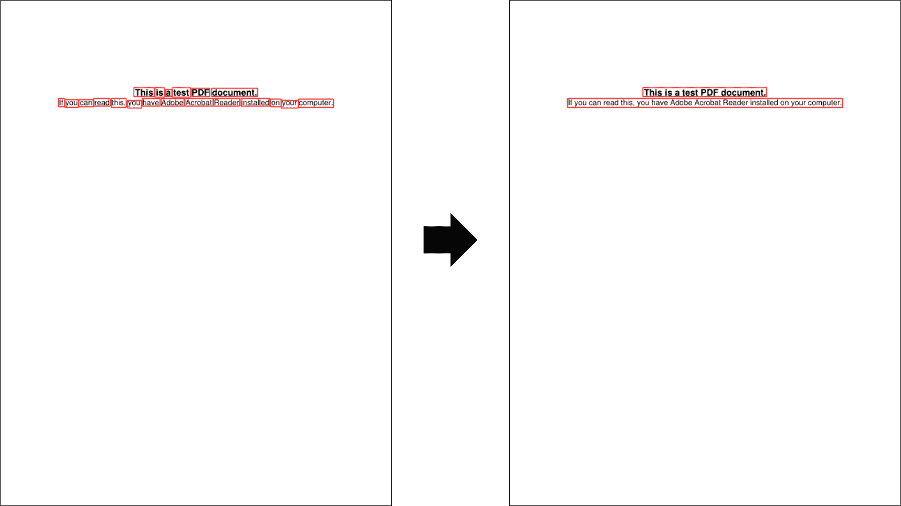
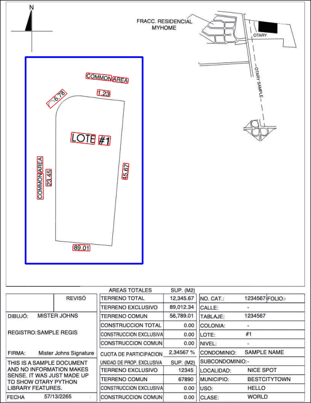

# OCR processing

Otary does not provide any OCR (Optical Character Recognition) engine. You are free to use the one that you prefer: Tesseract, EasyOCR, DocTR, Azure Document Intelligence, AWS Textract, etc...

## Instantiation

### Instantiate your OcrMultiOutput

Now, once you have your OCR outputs, you can manipulate them in a single unified object:

``` py linenums="1"
import otary as ot

ocrmo = ot.OcrMultiOutput.from_pytesseract(ocr_output)
```

This example was made using PyTesseract but you can use your favorite OCR engine.

### Otary OCR Engines Adapters

Here are all the OCR engines adapters available in Otary:

- [from_pytesseract](../api/vision/ocr/ocr_multi_output.md/#otary.vision.ocr.ocr_multi_output.OcrMultiOutput.from_pytesseract)
- [from_easyocr](../api/vision/ocr/ocr_multi_output.md/#otary.vision.ocr.ocr_multi_output.OcrMultiOutput.from_easyocr)
- [from_doctr](../api/vision/ocr/ocr_multi_output.md/#otary.vision.ocr.ocr_multi_output.OcrMultiOutput.from_doctr)
- [from_azure_document_intelligence](../api/vision/ocr/ocr_multi_output.md/#otary.vision.ocr.ocr_multi_output.OcrMultiOutput.from_azure_document_intelligence)
- [from_aws_textract](../api/vision/ocr/ocr_multi_output.md/#otary.vision.ocr.ocr_multi_output.OcrMultiOutput.from_aws_textract)

See the [class methods from OcrMultiOutput](../api/vision/ocr/ocr_multi_output.md) for more information.

### Adapt to any OCR

If your OCR engine is not in the list above, you can create your own OcrMultiOutput
object easily this way:

``` py linenums="1"
import otary as ot

your_ocr_outputs = ... # from your favorite OCR engine

ocrsos = []
for ocr_output in your_ocr_outputs:
    ocrso = ot.OcrSingleOutput(
        bbox=ot.Rectangle(ocr_output["bounding_box"]),
        text=ocr_output["text"],
        confidence=ocr_output["conf"],
        objectness=ocr_output["objectness"]
    )
    ocrsos.append(ocrso)

ocrmo = ot.OcrMultiOutput(ocrsos)
```

## Displaying

### Display OCR outputs

Here is a very quick example using Otary and Pytesseract as the OCR engine:

``` py linenums="1"
import otary as ot
import pytesseract

im = ot.Image.from_pdf('../tests/data/vision/example1/test.pdf')

ocr_outputs = pytesseract.image_to_data(
    im.as_pil(),
    output_type=pytesseract.Output.DICT
)
ocrmo = ot.OcrMultiOutput.from_pytesseract(ocr_outputs)

im.copy().draw_ocr_outputs(
    ocr_outputs=ocrmo.ocrsos,
    render=ot.OcrSingleOutputRender(thickness=1, default_color="red")
).show()
```

Here is what the following code would display:



### Rotated Bounding Boxes

If you have OCR outputs with rotated bounding boxes, you can also manipulating them
with Otary.

``` py linenums="1"

import otary as ot

filepath: str = "../tests/data/vision/example2/sample-otary-img1.pdf"

ocr_outputs = ... # from Azure Document Intelligence OCR engine for example

img = ot.Image.from_file(FILEPATH)

ocrmo = ot.OcrMultiOutput.from_azure_document_intelligence(
    azure_output=ocr_outputs,
    image_dim=(img.width, img.height),
    page_nb_to_analyze=0,
    level="word",
    assume_straight_pages=False
)

im = img.copy().draw_ocr_outputs(
    ocr_outputs=ocrmo.ocrsos,
    render=ot.OcrSingleOutputRender(thickness=1, default_color="blue")
)
```



### Axis-Aligned Bounding Boxes

You can force the usage of Axis-Aligned Bounding Boxes (AABB) instead of rotated Bounding Boxes (OBB) by setting `assume_straight_pages=True`

``` py linenums="1" hl_lines="6"
ocrmo = ot.OcrMultiOutput.from_azure_document_intelligence(
    azure_output=ocr_outputs,
    image_dim=(img.width, img.height),
    page_nb_to_analyze=0,
    level="word",
    assume_straight_pages=True
)

im = img.copy().draw_ocr_outputs(
    ocr_outputs=ocrmo.ocrsos,
    render=ot.OcrSingleOutputRender(thickness=1, default_color="blue")
)
```



## Analysis

### Key Information Extraction

Using Otary, you can easily extract key information from your OCR outputs.



Given the previous image, you can extract the value of the key "MUNICIPIO"
(located at the bottom right of the image) this way:

``` py linenums="1"
import otary as ot

im = ot.Image.from_file(filepath="path/to/file/image")

ocr_output = ... # from your OCR engine
ocrmo = OcrMultiOutput.from_aws_textract(ocr_output)

# find the value of the key "MUNICIPIO"
value = ot.HeuristicKeyInformationExtractor.extract(
    ocr_outputs=ocrmo,
    key="MUNICIPIO",
    closest_word_dist_thresh=im.dist_pct(pct=0.05), # 5% of image diagonal distance
    levenshtein_threshold=0.85
)

print(value.text) # BESTCITYTOWN
```


### Group Words

Modern OCR engines now have layout capabilities. They contain information about
pages, paragraphs, lines, words and more.

However, some OCR engines do not provide this information. In those cases, Otary
can help. You can reconstruct lines for example using the following code:

``` py linenums="1" hl_lines="11 12 13"
import otary as ot

im = ot.Image.from_pdf('../tests/data/vision/example1/test.pdf')

ocr_outputs = pytesseract.image_to_data(
    im.as_pil(),
    output_type=pytesseract.Output.DICT
)
ocrmo = ot.OcrMultiOutput.from_pytesseract(ocr_outputs)

ocrmo_groups, _ = ocrmo.group_words(
    min_word_dist=im.dist_pct(pct=0.05)
)

im.copy().draw_ocr_outputs(
    ocr_outputs=ocrmo_groups.ocrsos,
    render=ot.OcrSingleOutputRender(thickness=1, default_color="red")
).show()
```



### Find closest word to another

Using Otary, you can find the closest word to the right of any word.

Given the following document:


You could compute:

``` py linenums="1" hl_lines="10 11 12 13"
import otary as ot

im = ot.Image.from_pdf('../tests/data/vision/example1/test.pdf')

ocr_outputs = ... # from your favorite OCR engine
ocrmos = ...

print(ocrmo.ocrsos[4].text) # PDF

closest_word = ocrmo.find_closest_word(
    word=ocrmo.ocrsos[4],
    direction="right",
    dist_thresh=im.dist_pct(pct=0.05) # 5% of image diagonal distance
)

print(closest_word.text) # document.
```

You can do the same to the left:

``` py linenums="10"
closest_word = ocrmo.find_closest_word(
    word=ocrmo.ocrsos[4],
    direction="left",
    dist_thresh=im.dist_pct(pct=0.05)
)

print(closest_word.text) # test
```

### Find words in a given spatial region

Using Otary, you can find all OCR Bounding Box that are in a given spatial region.

``` py linenums="1" hl_lines="17"
import otary as ot

im = ot.Image.from_file("../tests/data/vision/example2/sample-otary-img1.pdf")

# define your OCR outputs
ocr_outputs = ... # from your favorite OCR engine
ocrmo = ...

# define your spatial region
polygon_array = np.array(
    [[60, 200], [130, 130], [270, 130], [270, 300], [250, 500], [60, 500]]
)
polygon = ot.Polygon(polygon_array)
aabb = polygon.aabb().expand(1.1)

# find words in the spatial region
ocrsos_crop = ocrmo.words_in(box=aabb)

# display
im.copy().draw_polygons(
    polygons=[aabb],
    render=ot.PolygonsRender(colors=["blue"], thickness=2),
).draw_ocr_outputs(
    ocr_outputs=ocrsos_crop,
    render=ot.OcrSingleOutputRender(thickness=1, default_color="red"),
).show()
```

This previous code would display:



### Drop duplicates

``` py linenums="1"
import otary as ot

im = ot.Image.from_file("../tests/data/vision/example2/sample-otary-img1.pdf")

# define your OCR outputs
ocr_outputs1 = ... # from your favorite OCR engine
ocrmo1 = ...

# imagine you have some other OCR outputs
ocr_outputs2 = ... # from your 2nd favorite OCR engine
ocrmo2 = ...

# merge ocr outputs
ocrmo = OcrMultiOutput.merge([ocrmo1, ocrmo2])

# drop duplicates
ocrmo.drop_duplicates(dist_thresh=im.dist_pct(pct=0.05))
```

!!! info "OCR Deduplication"

    OCR de-duplication can be useful when using free OCR engines and still
    want to detect precisely rotated bounding boxes. Currently, detecting
    words in any orientation is not that easy. One approach consists in rotating
    the image in different angles and then using the same OCR engine to detect
    words. Then you can de-rotate the found words and bounding boxes.

    ```py
    # Otary provides thoses methods
    image.rotate()
    bbox.rotate()
    ```

    Once you have all the words detected in all rotation angles restored in the
    original orientation of the image you can then de-duplicate the OCR outputs.
