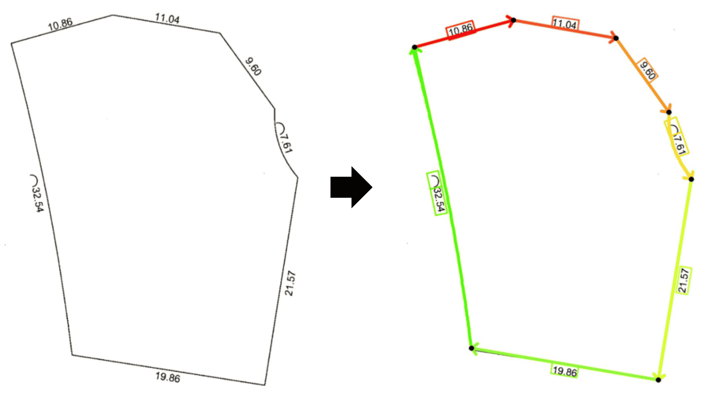

# Scoring

## Score your detected Geometry entities

Otary allows you to score the confidence of your detected Geometry Entities.

Let us suppose you have detected Segments, Contour, Corners using OpenCV for example.
Now, you need to evaluate the quality of the detected objects.

Otary allows you to compare your Geometry Entities to the pixels of the image
(ground truth).



``` py linenums="1"
im_other = im.copy().as_white()

for linear_entity in dle:
    if isinstance(linear_entity, VectorizedLinearSpline):
        im_other.draw_splines(
            splines=[linear_entity],
            render=LinearSplinesRender(
                thickness=5,
                default_color="black",
                as_vectors=False,
                pct_ix_head=0.25,
            ),
        )
    elif isinstance(linear_entity, Segment):
        im_other.draw_segments(
            segments=[linear_entity],
            render=SegmentsRender(
                thickness=5, default_color="black", as_vectors=False
            ),
        )
    else:
        raise RuntimeError(f"Unknown type {type(linear_entity)}")

score = im.score_contains_v2(im_other) # compare two images

print(score) # 0.97
```

If you prefer to have a list of scores for each detected Linear Entity, you can
use `score_contains_linear_entities` method instead.

``` py linenums="1"
scores = im.score_contains_linear_entities(entities=linear_entities)

print(scores) # [0.96, 0.98, 0.94, 0.89, 0.99, 0.76, 0.82]
```

You can even be more tolerant about the detected objects by dilating the pixels
of the ground truth image. This can be controled by the `dilate_kernel` and
the `dilate_iterations` parameters. This way, if it does not fit exactly but is
still close enough, the detected geometry object can be considered as valid for
a threshold that you may choose.

``` py linenums="1"
scores = im.score_contains_linear_entities(
    entities=linear_entities,
    dilate_kernel=(5, 5),
    dilate_iterations=2,
)

print(scores) # [0.99, 1.0, 0.99, 0.98, 1.0, 0.95, 0.97]
```

Explore the [Analysis](../api/image/analysis/scoring.md#otary.image.image.Image.score_contains_v2) part of the Otary Image module to learn more about scoring.
