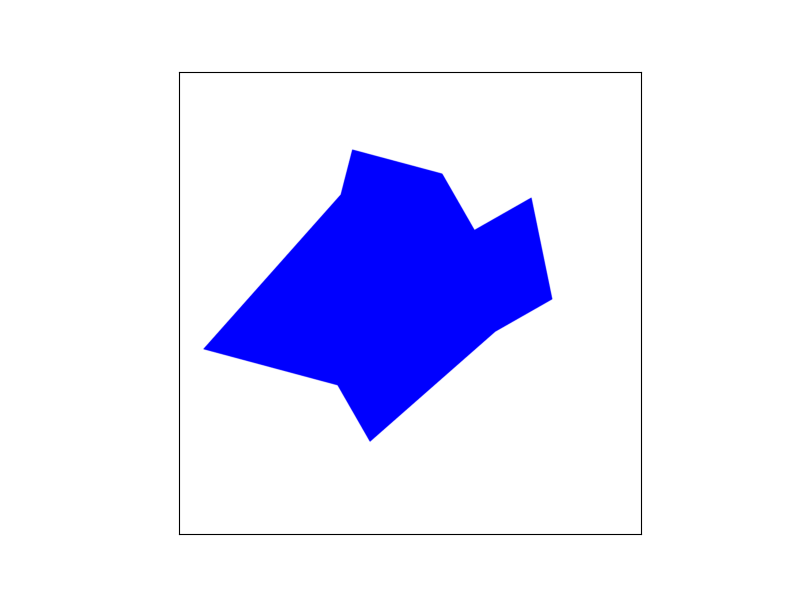

# Getting Started

## Installation

To start using Otary, simply install it via pip:

```bash
pip install otary
```

For more information on how to install Otary, please refer to the [Installation](installation.md) page.

## Basic example

Here is a very basic usage of the Otary library that you can use as a starting point
by simply copying and pasting the code below:

```python
import otary as ot

# instantiate an image
im = ot.Image.from_fillvalue(shape=(1000, 1000, 3))

# instantiate a polygon
polygon = ot.Polygon(points=[[1, 7], [3, 3], [3, 2], [5, 2], [6, 3], [7, 2], [8, 4], [7, 5], [5, 8], [4, 7]])

# scale the polygon
polygon *= 100

# rotate the polygon (pivot point is by default the centroid of the geometry entity)
polygon.rotate(angle=15, is_clockwise=True, is_degree=True)

# draw the polygon on the image
im.draw_polygons(
    polygons=[polygon],
    render=ot.PolygonsRender(
        is_filled=True,
        default_color="blue"
    )
)

im.show()
```



You can play around with this code in a script or a Jupyter notebook to explore to
the full power of Otary.

## Going further

You can explore more examples, tutorials and advanced functionalities in the [Learn](../learn/) section.

You can also jump to the [API Reference](../api/) to look for specific methods and classes or to get a deeper understanding of the library.
